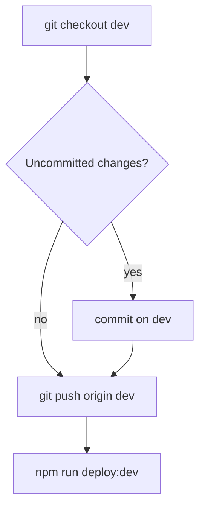

Deploy the **Mudt_new** theme to **dev** — branch **`dev`**: commit → **push GitHub** → SFTP [iratest.site](https://iratest.site/).

The user invoked `/deploy-dev` — **commit**, **push**, and **deploy** are allowed. **Never commit** `deploy.local.env`.

**GitHub:** https://github.com/irynaBilousSPDev/Mudt_new.git

**Database is NOT part of this command.** Prod DB clone to dev is **one-time only** — use `/import-db-dev` once.

## Flow (commit → push → SFTP)



### 1. Branch and inspect

```bash
git checkout dev
```

Parallel: `git status`, `git diff`, `git log -3 --oneline`

### 2. Commit — only if dirty

Skip when clean. Do not stage `deploy.local.env`. Commit messages: **English only**.

### 3. Push `dev` to GitHub (before SFTP)

```bash
git push origin dev
```

### 4. Deploy (SFTP)

```bash
npm run deploy:dev
```

Uploads **git-changed files** (last commit / `origin/dev..HEAD`) to `wp-content/themes/Mudt_new` on dev.

| Flag | When |
|------|------|
| `DEPLOY_FULL=true` | First deploy or server drift — upload entire theme |
| `DRY_RUN=true` | List files only, no upload |
| `DEPLOY_ALLOW_UNPUSHED=true` | Emergency deploy without push (avoid if possible) |

Config: `deploy.local.env` (copy from `deploy.local.env.example`).

## One-time setup (already done or run once)

| Step | Command |
|------|---------|
| DB clone prod → dev | `/import-db-dev` or `npm run import:db:dev` |
| Media uploads | `npm run import:uploads:dev` |
| Activate theme + plugins | WP admin on dev |

## Do not

- Import database from `/deploy-dev`
- Commit `deploy.local.env`
- Deploy production unless explicitly asked
