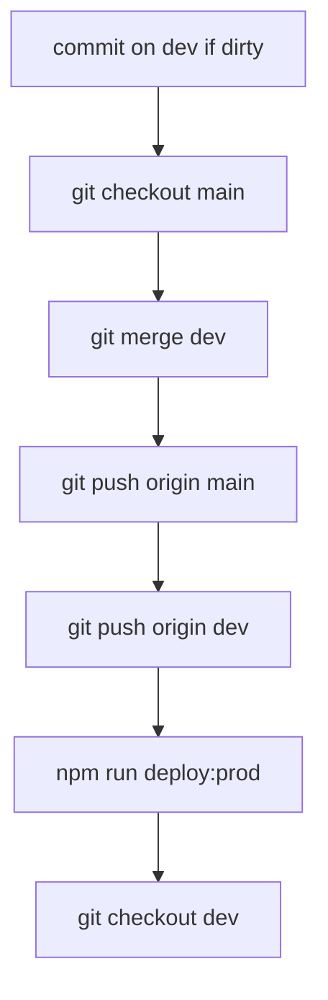

Deploy the **Mudt_new** theme to **production (Plesk / uni-munich.de)** — branch **`main`**: merge `dev` → `main` → **push GitHub** → FTPS upload.

Prod FTPS: `vmi1573265.contaboserver.net`, port **21** (`SFTP_PROD_USE_FTPS=true`). Config in `deploy.local.env`.

The user invoked `/deploy-prod` — **merge**, **push**, and **deploy** are allowed. **Never commit** `deploy.local.env`.

**GitHub:** https://github.com/irynaBilousSPDev/Mudt_new.git

| Branch | Use |
|--------|-----|
| **`dev`** | Day-to-day work + `/deploy-dev` → iratest.site |
| **`main`** | Production + `/deploy-prod` → uni-munich.de |

**Database is NOT part of this command.**

## Flow (dev → main → push → FTPS)



### 1. Finish work on `dev`

```bash
git checkout dev
```

Parallel: `git status`, `git diff`, `git log -3 --oneline`

If dirty: commit (English message). Do not stage `deploy.local.env`.

### 2. Merge into `main`

```bash
git checkout main
git pull origin main
git merge dev -m "Merge branch 'dev' into main for production deploy."
```

If `main` does not exist yet:

```bash
git checkout -b main
git push -u origin main
```

If merge conflicts: stop and report; do not force-push.

### 3. Push `main` (and `dev`)

```bash
git push origin main
git push origin dev
```

After merge, **`dev` and `main` should point to the same commit** — push both.

### 4. Deploy (FTPS)

**Prerequisites:** `deploy.local.env` has `SFTP_PROD_HOST`, `SFTP_PROD_USER`, `SFTP_PROD_PASSWORD`, `SFTP_PROD_REMOTE_PATH`.

Optional connectivity check (read-only):

```bash
npm run probe:prod
```

Deploy:

```bash
npm run deploy:prod
```

Uploads **git-changed files** (last commit / `origin/main..HEAD`) to `httpdocs/wp-content/themes/Mudt_new` on prod.

| Flag | When |
|------|------|
| `DEPLOY_FULL=true` | First prod deploy or server drift — upload entire theme |
| `DRY_RUN=true` | List files only, no upload |
| `DEPLOY_ALLOW_UNPUSHED=true` | Emergency deploy without push (avoid if possible) |

### 5. Return to `dev`

```bash
git checkout dev
```

## After deploy

- [ ] https://uni-munich.de/ — key pages including Professional Training and CRA Practitioner
- [ ] Dev site (iratest.site) unchanged unless you also ran `/deploy-dev`

## Do not

- Force-push `main` or `dev`
- Commit `deploy.local.env`
- Import database from `/deploy-prod`
- Run prod FTPS without confirming `SFTP_PROD_*` in `deploy.local.env`
